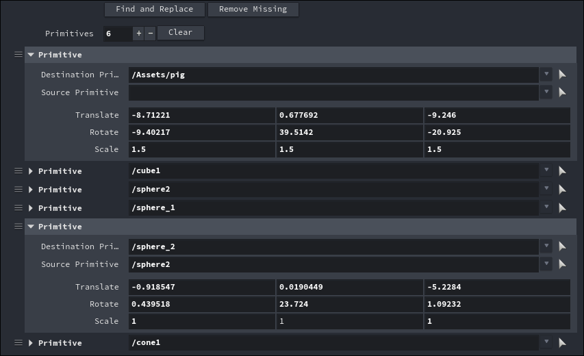
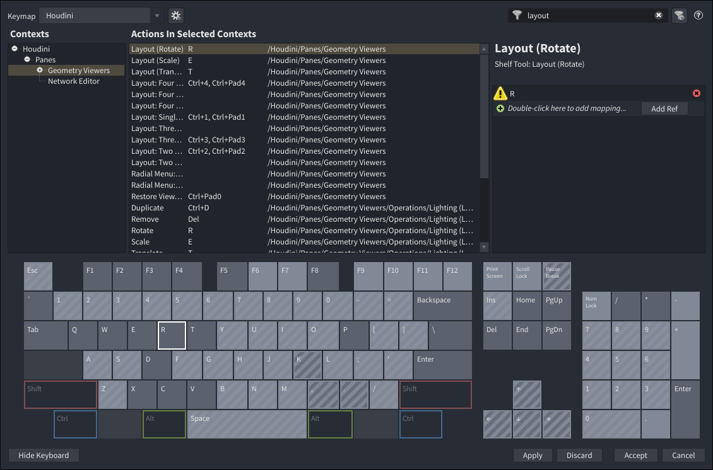

# Layout

A layout LOP node for SideFX Houdini.

This HDA allows to transform and duplicate primitives in the stage while exposing all edits in a simple interface that
can be edited.



## Installation

Layout is installed as a Houdini Package.

1. Go to the [Releases](https://github.com/beatreichenbach/houdini-layout/releases) page and download the latest
   `layout.zip`.
2. Navigate to your Houdini user preferences folder: `$HOME/houdini‹X›.‹Y›`
3. If you don't have a folder named `packages` in that directory, create it.
4. Extract the contents of the `.zip` file into the `packages` folder.
5. Restart Houdini. You can verify the installation by opening the **Package Browser** (**Windows > Package Browser**)
   and ensuring "Layout" is listed.

**Example Folder Structure:**

```text
├── houdini21.0
    ├── packages/
        ├── layout.json
        └── /layout
            └── (HDA files)
```

## Hotkeys

[Configure the hotkeys](https://www.sidefx.com/docs/houdini/basics/hotkeys.html) by binding the T, R, E keys to the
Layout (Translate), Layout (Rotate), Layout (Scale) actions respectively.

Either filter by "layout" or navigate to "Houdini > Panes > Geometry Viewers" to find the actions.



## About this Repository

| Directory | Description                                                                                                         |
|-----------|---------------------------------------------------------------------------------------------------------------------|
| `src/`    | Digital Assets and the package definition. During the release action they get packaged in the `layout.zip` archive. |
| `node/`   | The source code for the ViewerState and the HDA Module which is stored in the HDA.                                  |
| `build/`  | Build directory used to generate the release package.                                                               |

## License

MIT License. Copyright 2026 - Beat Reichenbach. See the [License](LICENSE) file for details.
